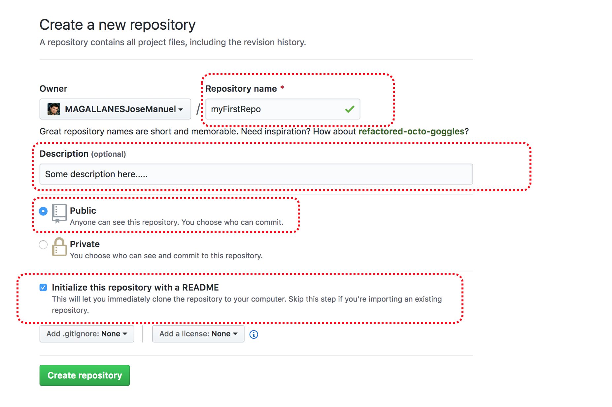
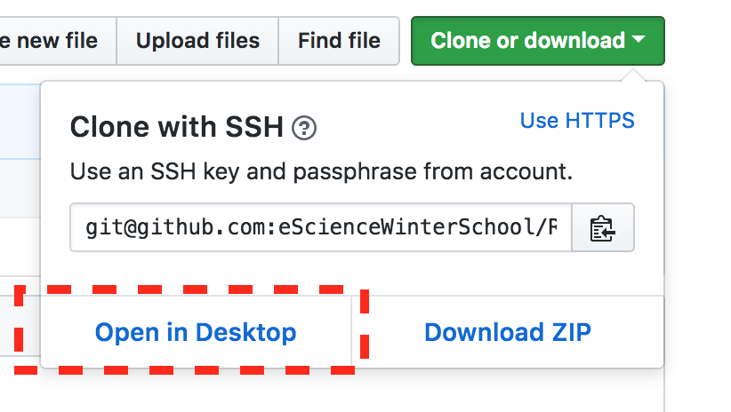
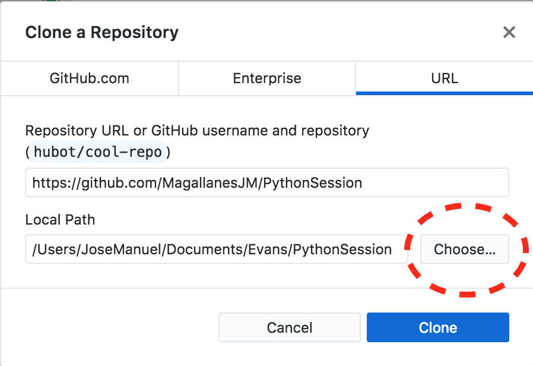

<br> 
<center></center>

# [Session 3: Data Science Tools for Reproducibility](https://github.com/eScienceUW-WinterSchool-2020/ReproducibilitySession)

### Prof. José Manuel Magallanes, PhD

* Associate Professor, Departamento de Ciencias Sociales, PONTIFICIA UNIVERSIDAD CATOLICA DEL PERU ([jmagallanes@pucp.edu.pe](mailto:jmagallanes@pucp.edu.pe)).

* Visiting Associate Professor, Evans School of Public Policy and Governance / Senior Data Science Fellow, eScience Institute, UNIVERSITY OF WASHINGTON ([magajm@uw.edu](mailto:magajm@uw.edu)).

_____


<br></br>

We will focus on the production of a simple paper (the simplest ever). Let me describe you the steps to follow:

1. **Create a GitHub account**. Go to [GitHub](https://github.com/) and **sign up** to create an account. Your username should have your name/surname. You should also download and install the [GitHub desktop](https://desktop.github.com/) app.

2. **Create a GitHub repository** Sign into Github, and create a repository or _repo_ there. You should complete the information shown in the figure below:


```{r repoCreation, echo=FALSE, fig.cap="**CREATING A REPO**", out.width = '100%',fig.align='center',out.extra='style="background-color: #9ecff7; padding:10px; display: inline-block;"'}

```

<br>
<br>


2. **Clone the Repo**. Once your repo is created, you should a mirror copy in your computer, that is a **clone**. Make sure the GitHub Client is already installed in your machine. You need to find the button **clone or download**; when you press it, select the option _Open in Desktop_ (You might get a message requesting that you confirm you want to clone the repo in the desktop):

```{r repoCloning, echo=FALSE, fig.cap="**CLONING A REPO**", out.width = '50%',fig.align='center',out.extra='style="background-color: #9ecff7; padding:10px; display: inline-block;"'}

```

After confirming the operation, the _desktop client_ will ask you **where** you want to save the local copy of the cloud repo, as shown here:

```{r repoFolder, echo=FALSE, fig.cap="**LOCAL FOLDER FOR A REPO**", out.width = '50%',fig.align='center',out.extra='style="background-color: #9ecff7; padding:10px; display: inline-block;"'}

```


3. **Upload a file to the repo**. When you need to send a file from your computer to this cloned repo, you need to put that file in that folder. Let's create a file for GitHub from Python, follow this steps:

* Take a look at [these data](https://en.wikipedia.org/wiki/Censorship_by_country).
* Make a **copy** of this [Colab Notebook](https://colab.research.google.com/drive/1zbvSXuKidACMPxOUbe7HDVAWh6ickxD8).
* Run the code there, it will save file in your repo just created.

4. **Synchronizing**. Your GitHub Client detects any changes in your GitHub. Go to your client and check that these changes from Colab are synced by pressing **FETCH ORIGIN**.


4. **Get the link to the data file**. The data can be accessed now (as long as you have an internet connection). Go to your repo in the cloud, and click on the file name. This will take you to the file contents. Depending on the file type you can or can not see the values. This is a **RDS** file, so you will NOT see the contents. Now, get the link to the data, by right-clicking on the option **download** or **raw** (whichever is available).

5. **Create the following document in R**. Go to your RStudio and create an RScript. The codes will be:

    
```{r, echo=TRUE, eval=FALSE}
# collecting
fileLink="linkToGithub repo"
MyFile=url(fileLink)
dataidx=readRDS(MyFile)

# Describing a categorical variable**:
tableONI=table(dataidx$ONIpolitical)
tableONI

# Using a plot for the categorical:
barplot(tableONI)


# Describing the numerical variables
summary(dataidx[,c(3,4)])

# Using a plot for the numerical:
boxplot(dataidx[,c(3,4)])

## Describing bivariate relationships

# * Numerical and categorical:

boxplot(dataidx$FHF~dataidx$Region)

#Boxplots were introduced by Tuckey (Tukey, John W (1977). Exploratory Data Analysis. Addison-Wesley.)

# * Numerical and Numerical
plot(dataidx$FHF~dataidx$RWB)

# The scatter plot is thought to be invented by  John Frederick W. Herschel according to this link: https://qz.com/1235712/the-origins-of-the-scatter-plot-data-visualizations-greatest-invention/

```


6. **Transform the RScript**. I have a series of templates. Let's use each one. For that, you need to go to our [repo](https://github.com/eScienceWinterSchool/Reproducibility), **fork** it to your GitHub account; and then clone the forked repo into your machine.

7. **Get a Zotero** account [here](https://www.zotero.org/user/register). Then, download and [install](https://www.zotero.org/download/) the desktop version and the **connector**. In your desktop, make citations for:
* [Paper](http://datavis.ca/papers/friendly-scat.pdf).
* [Book](https://www.amazon.com/Exploratory-Data-Analysis-Tukey-1977-01-01/dp/B019NER4VG/ref=sr_1_fkmr0_1?keywords=Tukey%2C+John+W+%281977%29.+Exploratory+Data+Analysis.+Addison-Wesley&qid=1580940897&sr=8-1-fkmr0).


_____

[Back to Winter school repos](https://github.com/eScienceUW-WinterSchool-2020)


